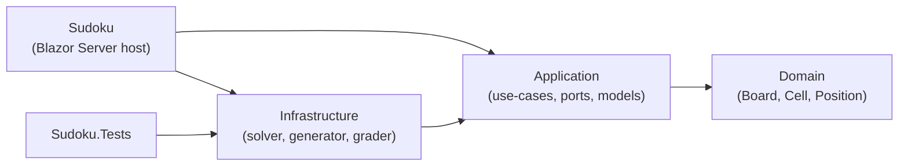

# Sudoku - Blazor Server (.NET 10)

A Sudoku game built with Blazor Server on .NET 10, structured with Clean
Architecture. Every puzzle is verified to have exactly one solution, and
difficulty is graded by the solving techniques a puzzle actually requires -
not just by how many clues were removed.

## Documentation

| Document | What it covers |
|----------|----------------|
| [Architecture](docs/architecture.md) | Layers, ports and adapters, dependency diagrams, project layout |
| [Architecture review](docs/architecture-review.md) | SOLID / Clean Architecture findings, what was fixed, and what was deliberately left alone |
| [Puzzle generation and difficulty](docs/puzzle-generation.md) | How boards are generated, why difficulty is technique-graded, performance numbers |
| [Solving techniques](docs/solving-techniques.md) | The human techniques the grader replays, with external references |
| [Testing and CI](docs/testing.md) | The unit test suite, the PowerShell smoke test, and the pipeline |
| [Lessons learned](docs/lessons-learned.md) | Every bug found along the way - how it was spotted, how the fix was verified, and what it taught |
| [Security posture](docs/security.md) | What is checked in and what never is, CI permissions, and the rules for the Azure rollout |
| [Deployment](docs/deployment.md) | Deploying to Azure App Service (Free F1) from GitHub Actions with OIDC and no stored secrets |
| [Tech stack](docs/tech-stack.md) | Frameworks, tools and the reasoning behind each choice |

## Features

### Gameplay
- **Four difficulty levels** - Easy, Medium, Hard, Professional, each graded
  by the techniques the puzzle genuinely demands
  ([how that works](docs/puzzle-generation.md))
- **Unique solutions** - every clue removal is verified to keep exactly one solution
- **Reliable hints** - answered from the solution recorded at generation time,
  so wrong entries can never break them
- **Pencil marks (notes)** - placing a real value sweeps that digit's notes
  from the row, column and box
- **Undo / redo** - full-board snapshots, so compound actions revert atomically
- **Timer and best times** - fastest solve per difficulty is remembered in the
  browser; auto-solve never sets records
- **Mistake counter** - judged against the known solution; undo does not
  forgive a mistake
- **Game persistence** - board, notes and the clock survive a page refresh,
  saved in encrypted browser storage with no database and no account
  ([how it works](docs/architecture.md#persistence-there-is-no-database))
- **Real-time conflict highlighting**, Validate / Solve / Clear All

### Input and accessibility
- **Keyboard-first grid** - one tab stop; arrows move the selection, digits
  place values or notes, Backspace/Delete clears, N toggles Notes mode
- **Screen-reader support** - `grid`/`row`/`gridcell` roles,
  `aria-activedescendant` tracking, descriptive per-cell labels

## Getting started

Prerequisites: the [.NET 10 SDK](https://dotnet.microsoft.com/download/dotnet/10.0)
(version pinned in `global.json`).

```bash
dotnet run --project Sudoku
```

Then open `https://localhost:7086` or `http://localhost:5260`.

```bash
dotnet test                              # 87 unit tests
./tools/smoke-test.ps1 -StartServer      # 14 HTTP smoke checks
```

The build treats warnings as errors (see `Directory.Build.props`).

## How to play

1. Pick a difficulty to generate a new puzzle.
2. Select a cell (click, or Tab to the board and use the arrow keys).
3. Enter a digit with the keyboard or the number pad.
4. Toggle **Notes** (or press N) to pencil in candidates instead.
5. Use **Hint** for the selected cell, **Validate** to check for conflicts,
   **Undo**/**Redo** to step through your actions, and **Solve** to finish.

## Architecture at a glance

Dependencies point inward; the domain knows nothing about the outside world.
Full detail, including the ports-and-adapters view, in
[docs/architecture.md](docs/architecture.md).



## License

This project is open source under the [MIT License](LICENSE).

## Acknowledgments

- [Leonhard Euler](https://en.wikipedia.org/wiki/Leonhard_Euler) for [Latin squares](https://en.wikipedia.org/wiki/Latin_square)
- [Howard Garns](https://en.wikipedia.org/wiki/Howard_Garns) for inventing [modern Sudoku](https://en.wikipedia.org/wiki/Sudoku)
- [Nikoli](https://en.wikipedia.org/wiki/Nikoli_%28publisher%29) for popularizing it in Japan
