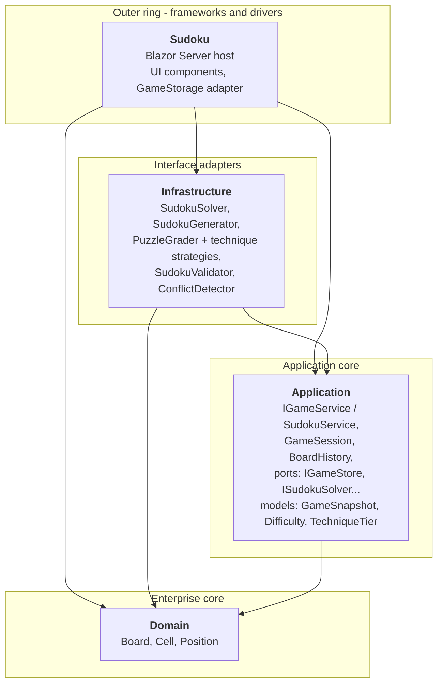
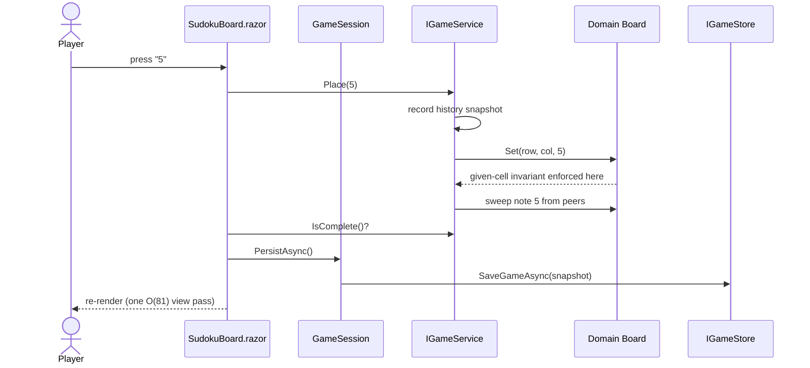

[← Back to main README](../README.md)

# Architecture

The solution is organized as Clean Architecture (ports and adapters): four
projects whose dependencies point strictly inward. The domain has no
dependencies at all; the web host is the only place that knows every layer
exists.

## Dependency direction



No inner project references an outer one. The rule is enforced by the
project files themselves - an inward-pointing reference simply does not
exist to compile against.

## Ports and adapters

The Application layer defines the ports; outer layers supply the adapters:

| Port (Application) | Adapter | Lives in |
|---|---|---|
| `IGameService` | `SudokuService` | Application (use-case coordinator) |
| `IGameStore` | `GameStorage` over `ProtectedLocalStorage` | Sudoku (web host) |
| `ISudokuGenerator` | `SudokuGenerator` | Infrastructure |
| `ISudokuSolver` | `SudokuSolver` (bitmask + most-constrained-cell) | Infrastructure |
| `IPuzzleGrader` | `PuzzleGrader` over `IGradingTechnique` strategies | Infrastructure |
| `ISudokuValidator` | `SudokuValidator` | Infrastructure |
| `IConflictDetector` | `ConflictDetector` | Infrastructure |
| `TimeProvider` (BCL) | `TimeProvider.System` / test fakes | Host / tests |

Because `GameSession` and `SudokuService` depend only on ports, the entire
game flow is unit-testable with in-memory fakes - no browser, no JS interop,
no clock.

## Flow of a user action



## Project layout

```
Sudoku.slnx
|-- Domain/                     Board (private cell array, read-only indexer,
|                               recorded solution), Cell (internal mutators),
|                               Position
|-- Application/
|   |-- Interfaces/             IGameService, IGameStore, ISudokuGenerator,
|   |                           ISudokuSolver, ISudokuValidator, IPuzzleGrader,
|   |                           IConflictDetector
|   |-- Models/                 Difficulty, TechniqueTier, GameSnapshot
|   `-- Services/               SudokuService (rules coordinator),
|                               GameSession (flow: restore/persist/clock/records),
|                               BoardHistory (undo/redo snapshots)
|-- Infrastructure/
|   |-- Grading/                GradingGrid (candidate model), IGradingTechnique,
|   |                           SinglesTechnique, LockedCandidatesTechnique,
|   |                           NakedPairsTechnique
|   `-- (root)                  SudokuSolver, SudokuGenerator, PuzzleGrader,
|                               SudokuValidator, ConflictDetector
|-- Sudoku/                     Blazor Server host
|   |-- Components/Pages/       SudokuBoard.razor (grid, toolbar, orchestration)
|   |-- Components/Game/        NumberPad, GameStatusBar, WinBanner, Celebration
|   |-- Components/Layout/      MainLayout, NavMenu
|   `-- Services/               GameStorage (IGameStore adapter)
|-- Sudoku.Tests/               87 xUnit tests over the real service graph
`-- tools/smoke-test.ps1        14-check HTTP smoke test (see docs/testing.md)
```

## Design decisions worth knowing

- **Domain invariants are compiler-enforced.** `Cell` mutators are `internal`
  and the cell array is private, so every write from outside the Domain
  assembly must pass through `Board` methods and their given-cell guard.
  Bypassing the rules is a compile error, not a code-review catch.
- **One recorded solution, many consumers.** The generator captures the
  completed grid before digging. Hints, Solve, and the mistake counter all
  read it - none of them ever re-solve a board the player may have filled in
  wrong. See [puzzle generation](puzzle-generation.md).
- **Full-board snapshot undo.** A placement can also sweep pencil marks from
  up to 20 peers; snapshotting the whole 81-cell board makes any action
  revert atomically for trivial cost.
- **One O(81) render pass.** Conflict highlighting and number-pad completion
  are derived once per render from per-unit digit counts, not recomputed per
  cell.
- **Scoped services per circuit.** In Blazor Server a singleton is shared by
  every connected player; game state is scoped so each visitor gets their
  own.

See also: [architecture review](architecture-review.md) ·
[tech stack](tech-stack.md) · [testing](testing.md)

[← Back to main README](../README.md)
