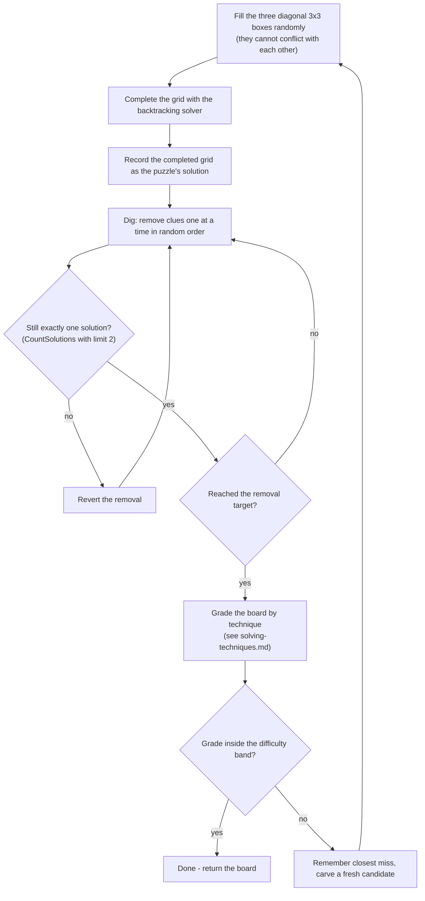

[← Back to main README](../README.md)

# Puzzle generation and difficulty

Difficulty in this app means *which techniques a human needs*, not *how many
clues were removed*. Those are different things: measurement during
development showed that about half of boards dug to "Hard" depth were
solvable with singles alone, and boards dug to "Professional" depth were
statistically no harder than Hard. Clue count is a poor proxy, so the
generator grades every candidate board and retries until it genuinely
demands its difficulty level.

## The pipeline

Two invariants hold throughout:

1. **Uniqueness at every step.** Every removal is verified with a
   solution-counter capped at 2; a removal that would allow a second
   solution is reverted immediately. A puzzle is never in an ambiguous state.
2. **The recorded solution stays true.** Because removals only ever revert
   or keep uniqueness, the grid captured before digging remains the puzzle's
   one answer. Hints, auto-solve, and mistake-counting all read it in O(1) -
   nothing ever re-solves a board the player may have filled in wrong.

## Difficulty bands

| Difficulty | Clues removed | Requirement (graded, not assumed) |
|-----------|---------------|------------------------------------|
| Easy | 40 | Solvable with naked/hidden singles alone |
| Medium | 50 | Needs a locked candidate or a naked pair |
| Hard | 55 | Needs more than those techniques (`Advanced`) |
| Professional | 60 | Same requirement as Hard, with fewer clues to work from |

Hard and Professional share a tier deliberately: both demand more than the
cheap techniques, and they differ in how much material the player gets.

**The fallback is biased easy.** If every carving attempt (capped at 60)
misses the band, the generator returns the closest miss - and for Medium the
distance function scores an `Advanced` board as far away, so a fallback
Medium can only ever err on the easy side. A Medium that plays slightly easy
is a mild disappointment; a Medium that needs chains is a wall. This rule is
pinned by a test: *a Medium board never requires advanced techniques*.

## The solver underneath

Generation calls the solver once per dig for the uniqueness check, so its
constant factor dominates generation time. It is a backtracking solver over
row/column/box bitmasks (candidate lookup = three mask reads instead of 27
cell scans) that always branches on the most constrained cell first. A
failed solve leaves the board untouched, and a board whose givens conflict
is rejected up front.

Measured medians per generated puzzle, band-grading retries included:

| Difficulty | Median | Worst observed |
|-----------|--------|----------------|
| Easy | 0.4 ms | 0.8 ms |
| Medium | 16 ms | 33 ms |
| Hard | 4.5 ms | 7.5 ms |
| Professional | 6.1 ms | 23 ms |

Generation still runs off the UI thread (`Task.Run`) so a Blazor circuit
stays responsive regardless.

## Correctness backstop

The test suite keeps a deliberately naive, independent solution counter and
asserts that the fast bitmask counter agrees with it on generated boards -
so a bug in the optimized path cannot silently redefine "unique".

See also: [solving techniques](solving-techniques.md) ·
[testing](testing.md)

[← Back to main README](../README.md)
