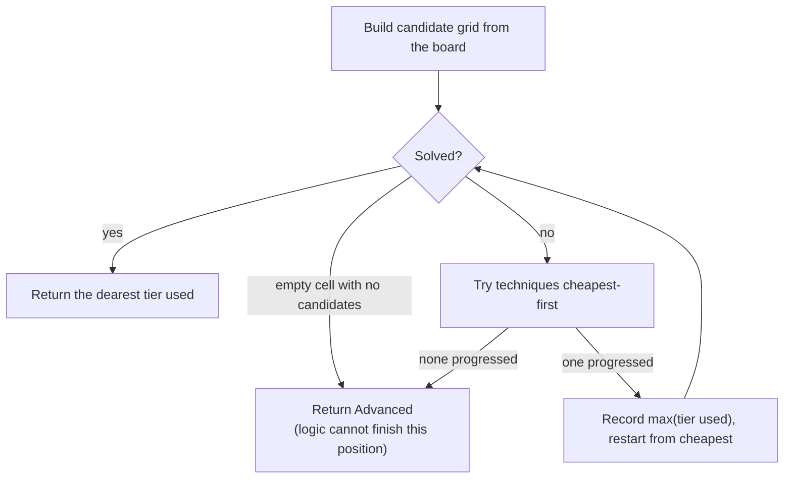

[← Back to main README](../README.md)

# Solving techniques

The difficulty grader replays human solving techniques from cheapest to
dearest over a candidate grid and reports the hardest tier it needed to
finish the puzzle. Each technique is a strategy class implementing
`IGradingTechnique` in `Infrastructure/Grading/` - adding a new one is a
class plus a DI registration, never an edit to the grading loop.

## Implemented tiers

### Tier 0 - Singles (`SinglesTechnique`)

- **Naked single**: a cell has exactly one candidate left, so that digit
  must go there.
- **Hidden single**: within a row, column or box, a digit has exactly one
  cell left that can hold it.

These are the bread and butter of every Sudoku; a board solvable by singles
alone grades **Easy**.

External references:
[Naked candidates (SudokuWiki)](https://www.sudokuwiki.org/Getting_Started) ·
[Hidden singles (HoDoKu)](https://hodoku.sourceforge.net/en/tech_singles.php)

### Tier 1 - Locked candidates (`LockedCandidatesTechnique`)

Also known as *intersection removal*, in both directions:

- **Pointing**: within a box, all candidates for a digit sit in one row (or
  column) - so the digit can be removed from that row/column outside the box.
- **Claiming**: within a row (or column), all candidates for a digit sit in
  one box - so the digit can be removed from the rest of that box.

External references:
[Intersection removal (SudokuWiki)](https://www.sudokuwiki.org/Intersection_Removal) ·
[Locked candidates (HoDoKu)](https://hodoku.sourceforge.net/en/tech_intersections.php)

### Tier 2 - Naked pairs (`NakedPairsTechnique`)

Two cells in a unit share the same two candidates, so those two digits can
go nowhere else in that unit and are eliminated from its other cells.

External references:
[Naked pairs (SudokuWiki)](https://www.sudokuwiki.org/Naked_Candidates) ·
[Naked subsets (HoDoKu)](https://hodoku.sourceforge.net/en/tech_naked.php)

### Tier 3 - Advanced (everything beyond)

If no implemented technique makes progress, the puzzle grades **Advanced**:
it demands something out of the implemented set - hidden pairs/triples, fish
patterns (X-Wing, Swordfish), coloring, chains, or trial and error. Hard and
Professional boards live here; they differ by clue count, not tier.

A broad catalog of those techniques, for the curious:
[SudokuWiki strategy index](https://www.sudokuwiki.org/Strategy_Families) ·
[HoDoKu techniques overview](https://hodoku.sourceforge.net/en/techniques.php)

## How the grader uses them

Two properties matter:

- **Cheapest-first, restart after progress.** The grade reflects what the
  puzzle *demands*, not what an expensive technique could also find. After
  any progress the loop restarts from singles, exactly as a human would
  cash in easy consequences before reaching for harder tools.
- **Grading is pure.** It works on a copied candidate model and never
  mutates the board; grading the same board twice gives the same answer
  (pinned by a test).

The same grading verdict drives generation - see
[puzzle generation](puzzle-generation.md) - so difficulty labels and the
techniques that justify them can never disagree.

[← Back to main README](../README.md)
