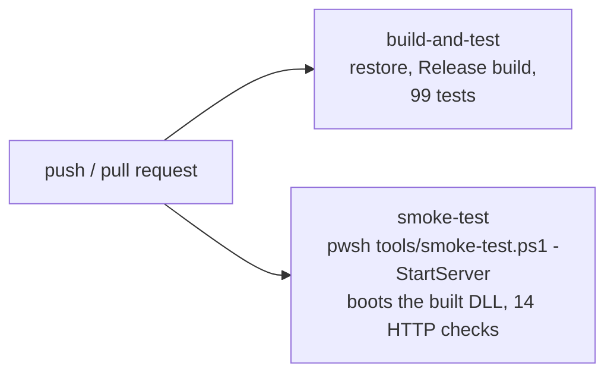

[← Back to main README](../README.md)

# Testing and CI

Two complementary layers of verification run on every push and pull request:
a unit test suite that proves the game is *correct*, and an HTTP smoke test
that proves the app *ships*. They catch different failure classes, and the
project has real examples of each (see [lessons learned](lessons-learned.md)).

## Unit and integration tests (`Sudoku.Tests`, 99 tests)

xUnit tests built over the real service graph rather than mocks, so they
exercise the shipped wiring. Coverage by area:

| Area | What is pinned |
|---|---|
| `Board` / `Cell` | Cloning fidelity (values, givens, notes, solution), the given-cell invariant, solution recording defends against bad input |
| `SudokuValidator` | Row, column and box constraints; the target cell is excluded from its own conflict check |
| `SudokuSolver` | Solves an empty board; rejects conflicting givens; a failed solve leaves the board untouched; the fast solution counter agrees with an independent naive counter |
| `SudokuGenerator` | Every generated board has exactly one solution (verified by the independent counter); the recorded solution agrees with the givens; clue counts by difficulty |
| `PuzzleGrader` | Band guarantees per difficulty; a Medium board never requires advanced techniques; grading is repeatable and does not mutate the board |
| `SudokuService` | Given cells cannot be overwritten; ClearAll keeps clues; Solve succeeds despite wrong entries; conflicts detected |
| Hints | Regression: hints survive wrong entries elsewhere; a hint corrects a wrong value in the selected cell |
| Undo / redo / notes | Atomic revert of compound actions (including swept pencil marks), redo invalidation, notes never count as placements |
| Mistakes | Wrong placements count, notes never do, undo does not forgive, snapshot round-trips the count |
| `GameSnapshot` | Full round-trip of values/givens/notes/solution; malformed snapshots rejected |
| `GameSession` | Restore-or-new startup, corrupt-save fallback, clock resume, persistence cadence, best-time rules (slower win keeps the record, auto-solve never records), solved games clear their save |
| `SecurityPostureTests` | Every finding from the security review, asserted against the real pipeline (see below) |

### Security regression tests

`SecurityPostureTests` boots the actual HTTP pipeline in-process with
`WebApplicationFactory<Program>` and asserts the hardening directly, so a
header or cookie policy dropped during a refactor fails `dotnet test` rather
than reaching production. Each test maps to a finding:

| Test | Prevents |
|---|---|
| `Responses_forbid_content_type_sniffing` | `nosniff` going missing |
| `Responses_carry_a_referrer_and_permissions_policy` | Referrer/Permissions policy removal |
| `Responses_are_protected_against_framing` | Clickjacking defences removal |
| `Content_security_policy_restricts_scripts_and_objects` | Regressing to a `frame-ancestors`-only policy |
| `Content_security_policy_never_allows_inline_scripts` | `'unsafe-inline'` creeping into `script-src` (it is required for `style-src`, so the temptation is real) |
| `Exactly_one_content_security_policy_header_is_sent` | The duplicate-header bug returning |
| `Antiforgery_cookie_is_secure_and_locked_down_in_production` | The `Secure` flag being dropped behind the proxy |
| `Antiforgery_cookie_policy_does_not_break_plain_http_development` | Someone "simplifying" the policy to `Always` everywhere, which throws on non-SSL requests |
| `Forwarded_headers_are_processed` | Losing the scheme/client-IP awareness the two above depend on |
| `Unknown_host_headers_are_rejected` / `The_configured_host_is_still_served` | `AllowedHosts` regressing to `*`, **and** a too-narrow value taking the site down |
| `Not_found_responses_do_not_leak_diagnostics` | Stack traces or framework detail in error pages |

The paired host tests are deliberate: a security control that can only fail
open is half-tested. One asserts the attack is blocked, the other asserts
legitimate traffic still works.

Time is controlled through `TimeProvider` fakes and persistence through an
in-memory `IGameStore`, so the flow tests run in milliseconds.

```bash
dotnet test
```

## HTTP smoke test (`tools/smoke-test.ps1`, 23 checks)

This is a Blazor Server app - there is no REST/JSON API. The HTTP surface is
pages, static assets, and the SignalR negotiate endpoint, and the smoke test
exercises exactly that surface end to end, **including failure conditions**:

Happy paths:
- `GET /` returns the game page and wires up the Blazor client script
- `GET /about` returns the about page
- `app.css`, the scoped-CSS bundle, and the favicon are served with correct
  content types
- `POST /_blazor/negotiate` opens a circuit negotiation (the transport the
  whole game runs over)

Security headers (the review's findings, re-checked against whatever is
actually running - locally in CI, and against the live URL after deploy):
- `X-Content-Type-Options`, `Referrer-Policy`, `Permissions-Policy` and
  `X-Frame-Options` are present
- The CSP restricts scripts and is sent exactly once
- HSTS is set when the target is HTTPS
- The antiforgery cookie carries `Secure` over HTTPS
- An unknown `Host` header is refused

Failure conditions:
- Unknown routes (including a fake deep API path) return 404 with the
  not-found page - and never leak a raw exception page
- A missing static asset returns 404
- `GET` on the POST-only negotiate endpoint is rejected
- `POST` to a page route is rejected
- A malformed negotiate version never produces a 500

The script boots the app from its **built DLL** as a single process (so CI
can stop it cleanly on any OS), waits for readiness, runs the checks, and
exits non-zero on any failure. It is compatible with both Windows
PowerShell 5.1 and PowerShell 7+ - the differences between those editions
bit twice during development; see [lessons learned](lessons-learned.md).

```bash
# self-contained: build, start, test, stop
./tools/smoke-test.ps1 -StartServer

# against an already-running instance
./tools/smoke-test.ps1 -BaseUrl http://localhost:5260
```

### Why a smoke test when there is no API?

Because it tests the layer no unit test can see: hosting. The project's
worst historical bug was a total outage - every page dead with a
`FileNotFoundException` on the static-asset bundle - while the entire unit
suite stayed green, since unit tests never boot the host. The smoke test
runs the built app and fetches those exact files, so that whole class of
configuration regression now fails a build in seconds.

## Browser verification

Rendering, layout and interaction claims cannot be seen by a unit test or by
the smoke test, so they are settled in a real browser. The method below is
not ceremony - every rule on it exists because skipping it produced a wrong
answer at least once ([lessons learned](lessons-learned.md)).

- **Drive real input.** Clicks resolved through the compositor, never
  `element.click()` or a constructed event. Dispatched events skip hit
  testing entirely, which is exactly where `pointer-events:none`, overlays
  and z-order bugs live.
- **Wait for the round-trip.** Blazor Server turns every interaction into a
  WebSocket round-trip. An assertion made in the same breath as the click
  reads the *previous* DOM and will call a working feature broken.
- **Measure, do not eyeball.** Geometry is answered with
  `getBoundingClientRect()` and `scrollWidth` against `clientWidth`, not by
  reading pixels off a screenshot - screenshots are scaled by
  `devicePixelRatio`, and the element may not even be in view.
- **Prove the fix in the live page first.** Setting the candidate property on
  the running DOM and re-measuring turns "this should fix it" into a
  measurement before a single line is edited.
- **Confirm the input landed.** When an interaction appears to do nothing, a
  temporary listener reporting `isTrusted` and the event offsets separates
  "the app is broken" from "the harness missed the target".

What that looks like in practice for this app: load the HTTP profile and
confirm a puzzle generates and the clock advances (proof the circuit is
live), click a cell and place a digit, toggle Notes, navigate away and back
to confirm the saved game restores, and read the console for exceptions.

## The pipeline (`.github/workflows/ci.yml`)

Two independent jobs on every push and PR to `main`:



Pipeline hygiene:
- `permissions: contents: read` - the workflow token carries least privilege
- The SDK is pinned by feature-band floor in `global.json` so local and CI
  builds resolve compatibly
- `TreatWarningsAsErrors` is on solution-wide (`Directory.Build.props`);
  the build is warning-free and stays that way

See also: [lessons learned](lessons-learned.md) · [tech stack](tech-stack.md)

[← Back to main README](../README.md)
